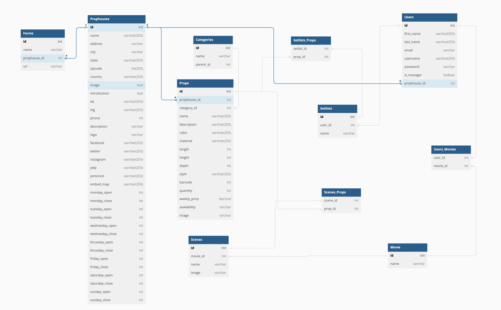

# Prop Master

Prop Master is a website for set designers to share the projects, also for prop house managers to maintain their inventory.

Prop Master was made with React.js and Python.

### Link to live site

https://prop-master.onrender.com/

### Technologies Used

- JavaScript
- Python
- Flask
- React.js
- REST API
- PostgreSQL
- Render

### Features

- Get / Create / Update / Delete Props
- Get / Update Prophouses
- Get / Create / Update / Delete Setlists

### Installation

1. Copy example .env file

```
cp backend/.env.example backend/.env
```

Your .env file should look like this:

```
DB_FILE=db/dev.db
JWT_SECRET=****
SCHEMA=prop_master_schema
FLASK_DEBUG=true
```

2. Run `openssl rand -base64 10` to generate a random JWT secret and add to your `.env` file.

3. In the backend folder, run the following command to install the dependencies.

```
pipenv install -r requirements.txt
```

4. After dependencies installed, still in backend folder, run the following command to migrate and seed the database.

```
pipenv shell
```

```
flask db upgrade
```

```
flask seed all
```

5. Run `flask run` in backend folders.

6. Run `npm install` in frontend folder (react-app).

7. Run `npm start` in frontend folder.

### Database Schema Design



### Screenshots

##### Registration Page

![registration_page]

##### Home Page

![home_page]

[registration_page]: ./registration_page.jpg
[home_page]: ./home_page.jpg
