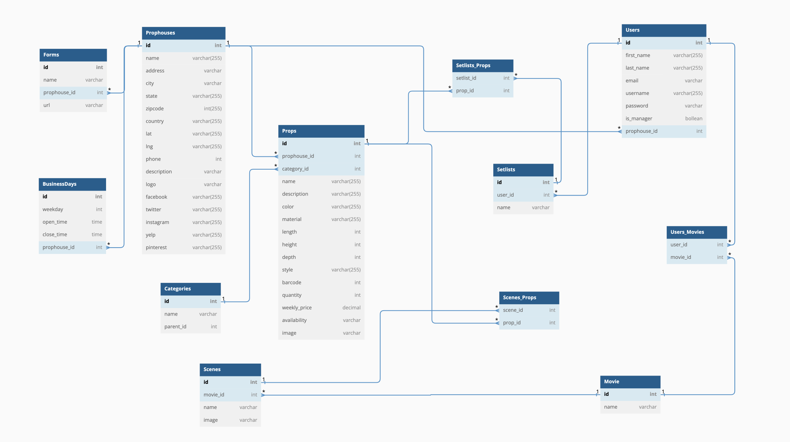

# `Prop Master`

## API (Backend)

### Features

- Props (CRUD)
- Setlist (CRUD)
- Prophouses
- Scene
- User Profile

### Database Design



## API Documentation

## USER AUTHENTICATION/AUTHORIZATION

### All endpoints that require authentication

All endpoints that require a current user to be logged in.

- Request: endpoints that require authentication
- Error Response: Require authentication

  - Status Code: 401
  - Headers:
    - Content-Type: application/json
  - Body:

    ```json
    {
      "message": "Authentication required",
      "statusCode": 401
    }
    ```

### All endpoints that require proper authorization

All endpoints that require authentication and the current user does not have the
correct role(s) or permission(s).

- Request: endpoints that require proper authorization
- Error Response: Require proper authorization

  - Status Code: 403
  - Headers:
    - Content-Type: application/json
  - Body:

    ```json
    {
      "message": "Forbidden",
      "statusCode": 403
    }
    ```

### Get the Current User

Returns the information about the current user that is logged in.

- Require Authentication: true
- Request

  - Method: GET
  - URL: api/me
  - Body: none

- Successful Response

  - Status Code: 200
  - Headers:
    - Content-Type: application/json
  - Body:

    ```json
    {
      "id": 1,
      "firstName": "John",
      "lastName": "Smith",
      "email": "john.smith@gmail.com",
      "username": "JohnSmith"
    }
    ```

### Log In a User

Logs in a current user with valid credentials and returns the current user's information.

- Require Authentication: false
- Request

  - Method: POST
  - URL: api/session
  - Headers:
    - Content-Type: application/json
  - Body:

    ```json
    {
      "credential": "john.smith@gmail.com",
      "password": "secret password"
    }
    ```

- Successful Response

  - Status Code: 200
  - Headers:
    - Content-Type: application/json
  - Body:

    ```json
    {
      "id": 1,
      "firstName": "John",
      "lastName": "Smith",
      "email": "john.smith@gmail.com",
      "username": "JohnSmith",
      "token": ""
    }
    ```

- Error Response: Invalid credentials

  - Status Code: 401
  - Headers:
    - Content-Type: application/json
  - Body:

    ```json
    {
      "message": "Invalid credentials",
      "statusCode": 401
    }
    ```

- Error response: Body validation errors

  - Status Code: 400
  - Headers:
    - Content-Type: application/json
  - Body:

    ```json
    {
      "message": "Validation error",
      "statusCode": 400,
      "errors": {
        "credential": "Email or username is required",
        "password": "Password is required"
      }
    }
    ```

### Sign Up a User

Creates a new user, logs them in as the current user, and returns the current
user's information.

- Require Authentication: false
- Request

  - Method: POST
  - URL: api/users
  - Headers:
    - Content-Type: application/json
  - Body:

    ```json
    {
      "firstName": "John",
      "lastName": "Smith",
      "email": "john.smith@gmail.com",
      "username": "JohnSmith",
      "password": "secret password"
    }
    ```

- Successful Response

  - Status Code: 200
  - Headers:
    - Content-Type: application/json
  - Body:

    ```json
    {
      "id": 1,
      "firstName": "John",
      "lastName": "Smith",
      "email": "john.smith@gmail.com",
      "username": "JohnSmith",
      "token": ""
    }
    ```

- Error response: User already exists with the specified email

  - Status Code: 403
  - Headers:
    - Content-Type: application/json
  - Body:

    ```json
    {
      "message": "User already exists",
      "statusCode": 403,
      "errors": {
        "email": "User with that email already exists"
      }
    }
    ```

- Error response: User already exists with the specified username

  - Status Code: 403
  - Headers:
    - Content-Type: application/json
  - Body:

    ```json
    {
      "message": "User already exists",
      "statusCode": 403,
      "errors": {
        "username": "User with that username already exists"
      }
    }
    ```

- Error response: Body validation errors

  - Status Code: 400
  - Headers:
    - Content-Type: application/json
  - Body:

    ```json
    {
      "message": "Validation error",
      "statusCode": 400,
      "errors": {
        "email": "Invalid email",
        "username": "Username is required",
        "firstName": "First Name is required",
        "lastName": "Last Name is required"
      }
    }
    ```

## Props

### Get all Props

Returns all the props in database.

- Require Authentication: false
- Request

  - Method: GET
  - URL: api/props
  - Query Parameters

    - category: integer, optional
    - scene: integer, optional
    - prophouse: integer, optional

  - Body: none

- Successful Response

  - Status Code: 200
  - Headers:
    - Content-Type: application/json
  - Body:

    ```json
    {
      "Props": [
        {
        "id": 1,
        "prophouseId":1,
        "categoryId":2,
        "name":"Oxford Red Chesterfield Leather Sofa",
        "color":"red",
        "material":"leather",
        "length":37,
        "depth":37,
        "height":30,
        "style":"Chesterfield",
        "quantity":3,
        "weeklyPrice":130.00,
        "availability":True,
        "image":"url"
        }
      ]
    }
    ```

### Get details of a Prop by id

Returns the details of a beer specified by its id.

- Require Authentication: false
- Request

  - Method: GET
  - URL: api/props/:propId
  - Body: none

- Successful Response

  - Status Code: 200
  - Headers:
    - Content-Type: application/json
  - Body:

    ```json
    {
    "id": 1,
    "prophouseId":1,
    "categoryId":2,
    "name":"Oxford Red Chesterfield Leather Sofa",
    "color":"red",
    "material":"leather",
    "length":37,
    "depth":37,
    "height":30,
    "style":"Chesterfield",
    "quantity":3,
    "weeklyPrice":130.00,
    "availability":True,
    "image":"url"
    }
    ```

- Error response: Couldn't find a Prop with the specified id

  - Status Code: 404
  - Headers:
    - Content-Type: application/json
  - Body:

    ```json
    {
      "message": "Prop couldn't be found",
      "statusCode": 404
    }
    ```

### Create a Prop

Creates and returns a new prop.

- Require Authentication: isManager is True
- Request

  - Method: POST
  - URL: api/props
  - Headers:
    - Content-Type: application/json
  - Body:

    ```json
    {
    "prophouseId":1,
    "categoryId":2,
    "name":"Oxford Red Chesterfield Leather Sofa",
    "color":"red",
    "material":"leather",
    "length":37,
    "depth":37,
    "height":30,
    "style":"Chesterfield",
    "quantity":3,
    "weeklyPrice":130.00,
    "availability":True,
    "image":"url"
    }
    ```

- Successful Response

  - Status Code: 201
  - Headers:
    - Content-Type: application/json
  - Body:

    ```json
     {
    "id": 1,
    "prophouseId":1,
    "categoryId":2,
    "name":"Oxford Red Chesterfield Leather Sofa",
    "color":"red",
    "material":"leather",
    "length":37,
    "depth":37,
    "height":30,
    "style":"Chesterfield",
    "quantity":3,
    "weeklyPrice":130.00,
    "availability":True,
    "image":"url"
    }
    ```

- Error Response: Body validation error

  - Status Code: 400
  - Headers:
    - Content-Type: application/json
  - Body:

    ```json
    {
      "message": "Validation Error",
      "statusCode": 400,
      "errors": {
        "name": "Name is required",
        "quantity": "Quantity is required",
        "weeklyPrice": "Weekly price is required",
        "availability": "Availability price is required",
        "prophouseId": "Prophouse id price is required",
        "categoryId": "Category id price is required"
      }
    }
    ```

### Edit a Prop

Updates and returns an existing prop.

- Require Authentication: isManager is True
- Require proper authorization: Prop must belong to the current user's Prophouse
- Request

  - Method: PUT
  - URL: api/props/:propId
  - Headers:
    - Content-Type: application/json
  - Body:

    ```json
    {
    "categoryId":2,
    "name":"Oxford Red Chesterfield Leather Sofa",
    "color":"red",
    "material":"leather",
    "length":37,
    "depth":37,
    "height":30,
    "style":"Chesterfield",
    "quantity":3,
    "weeklyPrice":130.00,
    "availability":True,
    "image":"url"
    }
    ```

- Successful Response

  - Status Code: 200
  - Headers:
    - Content-Type: application/json
  - Body:

    ```json
    {
    "id": 1,
    "prophouseId":1,
    "categoryId":2,
    "name":"Oxford Red Chesterfield Leather Sofa",
    "color":"red",
    "material":"leather",
    "length":37,
    "depth":37,
    "height":30,
    "style":"Chesterfield",
    "quantity":3,
    "weeklyPrice":130.00,
    "availability":True,
    "image":"url"
    }
    ```

- Error Response: Body validation error

  - Status Code: 400
  - Headers:
    - Content-Type: application/json
  - Body:

    ```json
    {
      "message": "Validation Error",
      "statusCode": 400,
      "errors": {
        "name": "Name is required",
        "quantity": "Quantity is required",
        "weeklyPrice": "Weekly price is required",
        "availability": "Availability price is required",
        "prophouseId": "Prophouse id price is required",
        "categoryId": "Category id price is required"
      }
    }
    ```

- Error response: Couldn't find a Prop with the specified id

  - Status Code: 404
  - Headers:
    - Content-Type: application/json
  - Body:

    ```json
    {
      "message": "Prop couldn't be found",
      "statusCode": 404
    }
    ```

### Delete a Prop

Deletes an existing prop.

- Require Authentication: isManager is True
- Require proper authorization: Prop must belong to the current user's Prophouse
- Request

  - Method: DELETE
  - URL: api/props/:propId
  - Body: none

- Successful Response

  - Status Code: 200
  - Headers:
    - Content-Type: application/json
  - Body:

    ```json
    {
      "message": "Successfully deleted",
      "statusCode": 200
    }
    ```

- Error response: Couldn't find a Prop with the specified id

  - Status Code: 404
  - Headers:
    - Content-Type: application/json
  - Body:

    ```json
    {
      "message": "Prop couldn't be found",
      "statusCode": 404
    }
    ```

## Prophouse

### Get all Prophouses

Returns all the prophouses in database.

- Require Authentication: false
- Request

  - Method: GET
  - URL: api/prophouses
  - Body: none

- Successful Response

  - Status Code: 200
  - Headers:
    - Content-Type: application/json
  - Body:

    ```json
    {
      "Prophouses": [
        {
          "id": 1,
          "name": "The Warner Bros. Property Department",
          "description": "Warner Bros. Property Department includes modern, mid century, industrial and antique furniture, smalls, lighting and fixtures for all your set dressing needs.",
          "address": "4000 Warner Blvd., Bldg.30",
          "city": "Burbank",
          "state": "CA",
          "zipcode": "91552",
          "phone": "818.954.2181",
          "logo": "url",
          "twitter": "url",
          "instagram": "url",
          "pinterest": "url",
          "businessDays": [
            {
              "id": 1,
              "weekday": 0,
              "openTime": 6,
              "closeTime": 18,
              "prophouseId": 1,
              "formattedWeekday": "Monday"
            }
          ]
        }
      ]
    }
    ```

### Get the prophouse managed by the Current User

Returns the prophouses managed (created) by the current user.

- Require Authentication: isManager is true
- Request

  - Method: GET
  - URL: /me/prophouse
  - Body: none

- Successful Response

  - Status Code: 200
  - Headers:
    - Content-Type: application/json
  - Body:

    ```json
    {
      "id": 1,
      "name": "The Warner Bros. Property Department",
      "description": "Warner Bros. Property Department includes modern, mid century, industrial and antique furniture, smalls, lighting and fixtures for all your set dressing needs.",
      "address": "4000 Warner Blvd., Bldg.30",
      "city": "Burbank",
      "state": "CA",
      "zipcode": "91552",
      "phone": "818.954.2181",
      "logo": "url",
      "twitter": "url",
      "instagram": "url",
      "pinterest": "url"
    }
    ```

### Create a Prophouse

Creates and returns a new prophouse.

- Require Authentication: isManager is True
- Request

  - Method: POST
  - URL: api/prophouses
  - Headers:
    - Content-Type: application/json
  - Body:

    ```json
    {
      "name": "The Warner Bros. Property Department",
      "description": "Warner Bros. Property Department includes modern, mid century, industrial and antique furniture, smalls, lighting and fixtures for all your set dressing needs.",
      "address": "4000 Warner Blvd., Bldg.30",
      "city": "Burbank",
      "state": "CA",
      "zipcode": "91552",
      "phone": "818.954.2181",
      "logo": "url",
      "twitter": "url",
      "instagram": "url",
      "pinterest": "url",
      "businessDays": [{ "weekday": 0, "openTime": 6, "closeTime": 18 }]
    }
    ```

- Successful Response

  - Status Code: 201
  - Headers:
    - Content-Type: application/json
  - Body:

    ```json
    {
      "id": 1,
      "name": "The Warner Bros. Property Department",
      "description": "Warner Bros. Property Department includes modern, mid century, industrial and antique furniture, smalls, lighting and fixtures for all your set dressing needs.",
      "address": "4000 Warner Blvd., Bldg.30",
      "city": "Burbank",
      "state": "CA",
      "zipcode": "91552",
      "phone": "818.954.2181",
      "logo": "url",
      "twitter": "url",
      "instagram": "url",
      "pinterest": "url",
      "businessDays": [
        {
          "id": 1,
          "weekday": 0,
          "openTime": 6,
          "closeTime": 18,
          "prophouseId": 1,
          "formattedWeekday": "Monday"
        }
      ]
    }
    ```

- Error Response: Body validation error

  - Status Code: 400
  - Headers:
    - Content-Type: application/json
  - Body:

    ```json
    {
      "message": "Validation Error",
      "statusCode": 400,
      "errors": {
        "name": "Name is required",
        "description": "Description is required",
        "address": "Address is required",
        "city": "City is required",
        "state": "State is required",
        "zipcode": "Zipcode is required",
        "phone": "Phone is required"
      }
    }
    ```

### Edit a Prophouse

Updates and returns an existing prophouse.

- Require Authentication: isManager is True
- Require proper authorization: Prophouse must managed by current user
- Request

  - Method: PUT
  - URL: api/prophouses/:prophouseId
  - Headers:
    - Content-Type: application/json
  - Body:

    ```json
    {
      "name": "The Warner Bros. Property Department",
      "description": "Warner Bros. Property Department includes modern, mid century, industrial and antique furniture, smalls, lighting and fixtures for all your set dressing needs.",
      "address": "4000 Warner Blvd., Bldg.30",
      "city": "Burbank",
      "state": "CA",
      "zipcode": "91552",
      "phone": "818.954.2181",
      "logo": "url",
      "twitter": "url",
      "instagram": "url",
      "pinterest": "url",
      "businessDays": [
        {
          "id": 1,
          "weekday": 0,
          "openTime": 6,
          "closeTime": 18
        }
      ]
    }
    ```

- Successful Response

  - Status Code: 200
  - Headers:
    - Content-Type: application/json
  - Body:

    ```json
    {
      "id": 1,
      "name": "The Warner Bros. Property Department",
      "description": "Warner Bros. Property Department includes modern, mid century, industrial and antique furniture, smalls, lighting and fixtures for all your set dressing needs.",
      "address": "4000 Warner Blvd., Bldg.30",
      "city": "Burbank",
      "state": "CA",
      "zipcode": "91552",
      "phone": "818.954.2181",
      "logo": "url",
      "twitter": "url",
      "instagram": "url",
      "pinterest": "url",
      "businessDays": [
        {
          "id": 1,
          "weekday": 0,
          "openTime": 6,
          "closeTime": 18,
          "prophouseId": 1,
          "formattedWeekday": "Monday"
        }
      ]
    }
    ```

- Error Response: Body validation error

  - Status Code: 400
  - Headers:
    - Content-Type: application/json
  - Body:

    ```json
    {
      "message": "Validation Error",
      "statusCode": 400,
      "errors": {
        "name": "Name is required",
        "description": "Description is required",
        "address": "Address is required",
        "city": "City is required",
        "state": "State is required",
        "zipcode": "Zipcode is required",
        "phone": "Phone is required"
      }
    }
    ```

- Error response: Couldn't find a Prophouse with the specified id

  - Status Code: 404
  - Headers:
    - Content-Type: application/json
  - Body:

    ```json
    {
      "message": "Prophouse couldn't be found",
      "statusCode": 404
    }
    ```

### Delete a Prophouse

Deletes an existing prophouse.

- Require Authentication: isManager is True
- Require proper authorization: Prophouse must managed by current user
- Request

  - Method: DELETE
  - URL: api/prophouses/:prophouseId
  - Body: none

- Successful Response

  - Status Code: 200
  - Headers:
    - Content-Type: application/json
  - Body:

    ```json
    {
      "message": "Successfully deleted",
      "statusCode": 200
    }
    ```

- Error response: Couldn't find a Prophouse with the specified id

  - Status Code: 404
  - Headers:
    - Content-Type: application/json
  - Body:

    ```json
    {
      "message": "Prophouse couldn't be found",
      "statusCode": 404
    }
    ```

## Prophouse Form

### Get all Form of a Prophouse

Returns all the prophouses in database.

- Require Authentication: false
- Request

  - Method: GET
  - URL: api/prophouses/:prophouseId/forms
  - Body: none

- Successful Response

  - Status Code: 200
  - Headers:
    - Content-Type: application/json
  - Body:

    ```json
    {
      "Prophouses": [
        {
          "id": 1,
          "name": "The Warner Bros. Property Department",
          "description": "Warner Bros. Property Department includes modern, mid century, industrial and antique furniture, smalls, lighting and fixtures for all your set dressing needs.",
          "address": "4000 Warner Blvd., Bldg.30",
          "city": "Burbank",
          "state": "CA",
          "zipcode": "91552",
          "phone": "818.954.2181",
          "logo": "url",
          "twitter": "url",
          "instagram": "url",
          "pinterest": "url",
          "businessDays": [
            {
              "id": 1,
              "weekday": 0,
              "openTime": 6,
              "closeTime": 18,
              "prophouseId": 1,
              "formattedWeekday": "Monday"
            }
          ]
        }
      ]
    }
    ```

Returns the prophouses managed (created) by the current user.

- Require Authentication: isManager is true
- Request

  - Method: GET
  - URL: /me/prophouse
  - Body: none

- Successful Response

  - Status Code: 200
  - Headers:
    - Content-Type: application/json
  - Body:

    ```json
    {
      "id": 1,
      "name": "The Warner Bros. Property Department",
      "description": "Warner Bros. Property Department includes modern, mid century, industrial and antique furniture, smalls, lighting and fixtures for all your set dressing needs.",
      "address": "4000 Warner Blvd., Bldg.30",
      "city": "Burbank",
      "state": "CA",
      "zipcode": "91552",
      "phone": "818.954.2181",
      "logo": "url",
      "twitter": "url",
      "instagram": "url",
      "pinterest": "url"
    }
    ```

### Create a Form for a Prophouse

Creates and returns a new prophouse.

- Require Authentication: isManager is True
- Request

  - Method: POST
  - URL: api/prophouses/:prophouseId/forms
  - Headers:
    - Content-Type: application/json
  - Body:

    ```json
    {
      "name": "The Warner Bros. Property Department",
      "description": "Warner Bros. Property Department includes modern, mid century, industrial and antique furniture, smalls, lighting and fixtures for all your set dressing needs.",
      "address": "4000 Warner Blvd., Bldg.30",
      "city": "Burbank",
      "state": "CA",
      "zipcode": "91552",
      "phone": "818.954.2181",
      "logo": "url",
      "twitter": "url",
      "instagram": "url",
      "pinterest": "url",
      "businessDays": [{ "weekday": 0, "openTime": 6, "closeTime": 18 }]
    }
    ```

- Successful Response

  - Status Code: 201
  - Headers:
    - Content-Type: application/json
  - Body:

    ```json
    {
      "id": 1,
      "name": "The Warner Bros. Property Department",
      "description": "Warner Bros. Property Department includes modern, mid century, industrial and antique furniture, smalls, lighting and fixtures for all your set dressing needs.",
      "address": "4000 Warner Blvd., Bldg.30",
      "city": "Burbank",
      "state": "CA",
      "zipcode": "91552",
      "phone": "818.954.2181",
      "logo": "url",
      "twitter": "url",
      "instagram": "url",
      "pinterest": "url",
      "businessDays": [
        {
          "id": 1,
          "weekday": 0,
          "openTime": 6,
          "closeTime": 18,
          "prophouseId": 1,
          "formattedWeekday": "Monday"
        }
      ]
    }
    ```

- Error Response: Body validation error

  - Status Code: 400
  - Headers:
    - Content-Type: application/json
  - Body:

    ```json
    {
      "message": "Validation Error",
      "statusCode": 400,
      "errors": {
        "name": "Name is required",
        "description": "Description is required",
        "address": "Address is required",
        "city": "City is required",
        "state": "State is required",
        "zipcode": "Zipcode is required",
        "phone": "Phone is required"
      }
    }
    ```

Updates and returns an existing prophouse.

- Require Authentication: isManager is True
- Require proper authorization: Prophouse must managed by current user
- Request

  - Method: PUT
  - URL: api/prophouses/:prophouseId
  - Headers:
    - Content-Type: application/json
  - Body:

    ```json
    {
      "name": "The Warner Bros. Property Department",
      "description": "Warner Bros. Property Department includes modern, mid century, industrial and antique furniture, smalls, lighting and fixtures for all your set dressing needs.",
      "address": "4000 Warner Blvd., Bldg.30",
      "city": "Burbank",
      "state": "CA",
      "zipcode": "91552",
      "phone": "818.954.2181",
      "logo": "url",
      "twitter": "url",
      "instagram": "url",
      "pinterest": "url",
      "businessDays": [
        {
          "id": 1,
          "weekday": 0,
          "openTime": 6,
          "closeTime": 18
        }
      ]
    }
    ```

- Successful Response

  - Status Code: 200
  - Headers:
    - Content-Type: application/json
  - Body:

    ```json
    {
      "id": 1,
      "name": "The Warner Bros. Property Department",
      "description": "Warner Bros. Property Department includes modern, mid century, industrial and antique furniture, smalls, lighting and fixtures for all your set dressing needs.",
      "address": "4000 Warner Blvd., Bldg.30",
      "city": "Burbank",
      "state": "CA",
      "zipcode": "91552",
      "phone": "818.954.2181",
      "logo": "url",
      "twitter": "url",
      "instagram": "url",
      "pinterest": "url",
      "businessDays": [
        {
          "id": 1,
          "weekday": 0,
          "openTime": 6,
          "closeTime": 18,
          "prophouseId": 1,
          "formattedWeekday": "Monday"
        }
      ]
    }
    ```

- Error Response: Body validation error

  - Status Code: 400
  - Headers:
    - Content-Type: application/json
  - Body:

    ```json
    {
      "message": "Validation Error",
      "statusCode": 400,
      "errors": {
        "name": "Name is required",
        "description": "Description is required",
        "address": "Address is required",
        "city": "City is required",
        "state": "State is required",
        "zipcode": "Zipcode is required",
        "phone": "Phone is required"
      }
    }
    ```

- Error response: Couldn't find a Prophouse with the specified id

  - Status Code: 404
  - Headers:
    - Content-Type: application/json
  - Body:

    ```json
    {
      "message": "Prophouse couldn't be found",
      "statusCode": 404
    }
    ```

### Delete a Form from a Prophouse

Deletes an existing prophouse.

- Require Authentication: isManager is True
- Require proper authorization: Prophouse must managed by current user
- Request

  - Method: DELETE
  - URL: api/prophouses/:prophouseId/forms/:formId
  - Body: none

- Successful Response

  - Status Code: 200
  - Headers:
    - Content-Type: application/json
  - Body:

    ```json
    {
      "message": "Successfully deleted",
      "statusCode": 200
    }
    ```

- Error response: Couldn't find a Prophouse with the specified id

  - Status Code: 404
  - Headers:
    - Content-Type: application/json
  - Body:

    ```json
    {
      "message": "Prophouse couldn't be found",
      "statusCode": 404
    }
    ```
